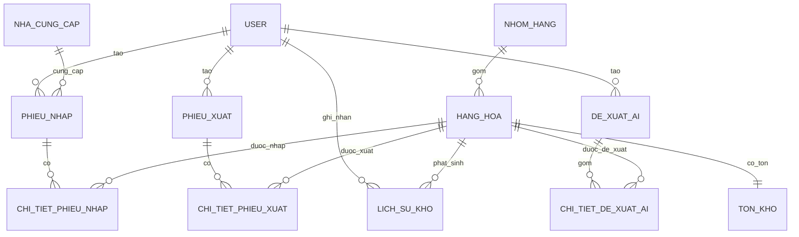

# Database Design Skill — QuanLyKhoAI

## 1. Bối cảnh bắt buộc
Đây là database của hệ thống Quản lý Kho, không phải database mẫu laptop/sản phẩm.

### User
- id: PK
- username: unique, not null
- password: not null
- full_name: not null
- role: not null
- role sử dụng trong project: `QuanLy`, `ThuKho`, `KeToan`

### NhomHang
- id: PK
- ten_nhom: unique, not null
- mo_ta: nullable

### HangHoa
- id: PK
- ma_nhom: logical FK → NhomHang.id
- ten_hang: not null
- don_vi_tinh: not null
- ma_barcode: unique, nullable
- gia_nhap
- gia_ban
- ton_toi_thieu

### NhaCungCap
- id: PK
- ten_ncc
- so_dien_thoai
- email
- dia_chi

### PhieuNhap
- id: PK
- ma_ncc: logical FK → NhaCungCap.id
- ma_tai_khoan: logical FK → User.id
- ngay_nhap
- tong_tien
- trang_thai

### ChiTietPhieuNhap
- id: PK
- ma_phieu_nhap: logical FK → PhieuNhap.id
- ma_hang: logical FK → HangHoa.id
- so_luong
- don_gia
- thanh_tien

### TonKho
- id: PK
- ma_hang: unique, logical FK → HangHoa.id
- so_luong
- ngay_cap_nhat

### LichSuKho
- id: PK
- ma_hang: logical FK → HangHoa.id
- ma_tai_khoan: logical FK → User.id
- loai_giao_dich
- so_luong
- thoi_gian
- ghi_chu

### PhieuXuat
- id: PK
- ma_tai_khoan: logical FK → User.id
- ngay_xuat
- ly_do
- trang_thai

### ChiTietPhieuXuat
- id: PK
- ma_phieu_xuat: logical FK → PhieuXuat.id
- ma_hang: logical FK → HangHoa.id
- so_luong

### DeXuatAI
- id: PK
- ma_tai_khoan: logical FK → User.id
- ngay_tao
- noi_dung
- trang_thai
- ly_do

### ChiTietDeXuatAI
- id: PK
- ma_de_xuat: logical FK → DeXuatAI.id
- ma_hang: logical FK → HangHoa.id
- so_luong_de_xuat
- ly_do

## 2. Quan hệ ERD bắt buộc

## 3. Quy tắc thiết kế
- Không đổi tên bảng/cột chỉ để khớp một ví dụ khác.
- Không tự thêm Product/Category/Customer nếu requirements của project không có.
- Kiểm tra PK, unique, nullability, logical FK, index và toàn vẹn dữ liệu.
- Với code hiện tại, một số quan hệ đang được biểu diễn bằng cột `Integer` thay vì `ForeignKey`; khi review phải nói rõ đây là trạng thái implementation hiện tại, không được giả vờ rằng DB đã có FK vật lý.
- `TonKho.ma_hang` phải duy nhất để mỗi hàng hóa có một bản ghi tồn.
- AI proposal là dữ liệu nghiệp vụ; việc duyệt proposal không tự động thay đổi TonKho.
- Chỉ sau khi phiếu nhập được xác nhận mới cập nhật TonKho và LichSuKho.

## Outputs
- docs/database-design.md
- docs/erd.md
- database/schema.sql hoặc migration tương ứng với DB thực tế
