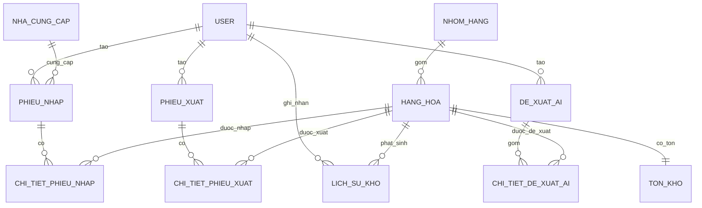

# ERD — Hệ thống Quản lý Kho tích hợp AI

## User
| Trường | Ý nghĩa |
|---|---|
| id | Khóa chính |
| username | Tên đăng nhập, duy nhất |
| password | Mật khẩu đã mã hóa |
| full_name | Họ tên |
| role | QuanLy / ThuKho / KeToan |

## Ghi chú implementation
Trong code hiện tại, các quan hệ FK đang được lưu bằng các cột Integer như `ma_hang`, `ma_tai_khoan`, `ma_phieu_nhap`...; cần phân biệt "logical FK" với "ForeignKey constraint vật lý" khi viết báo cáo.
